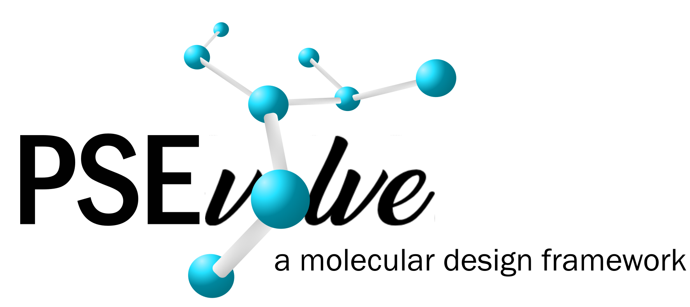

 Code for the paper 

# "Machine-guided solvent design for lignin-first biorefineries and lignin upgrading" 

by Laura König-Mattern, Edgar I. Sanchez Medina, Anastasia O. Komarova, Steffen Linke, Liisa Rihko-Struckmann, Jeremy S. Luterbacher, and Kai Sundmacher <\center>

Date: Feb 20, 2024

PSEvolve is a genetic algorithm for molecular design (available [here](https://github.com/koenigmattern/PSEvolve) In this repo, PSEvolve was tailored for designing
solvents with high lignin solubilities and for aldehyde-assisted fractionation.

  <\center> 

main_lignin.py: Main file for solvent design. 
- use group_constraints = 'AAF' for solvent design for aldehyde-assisted fractionation
- use group_constraints = None for simply designin solvents with high lignin solubility

utils.py:
- coantains all functions of PSEvolve, tailored for lignin solvent design

get_GNN_pred.py
- if you simply want to predict the lignin solubilities of specific solvents, use this function
- specify the solvents in "pred_mols.csv"
- run this function and open "pred_mols.csv" again to see the results